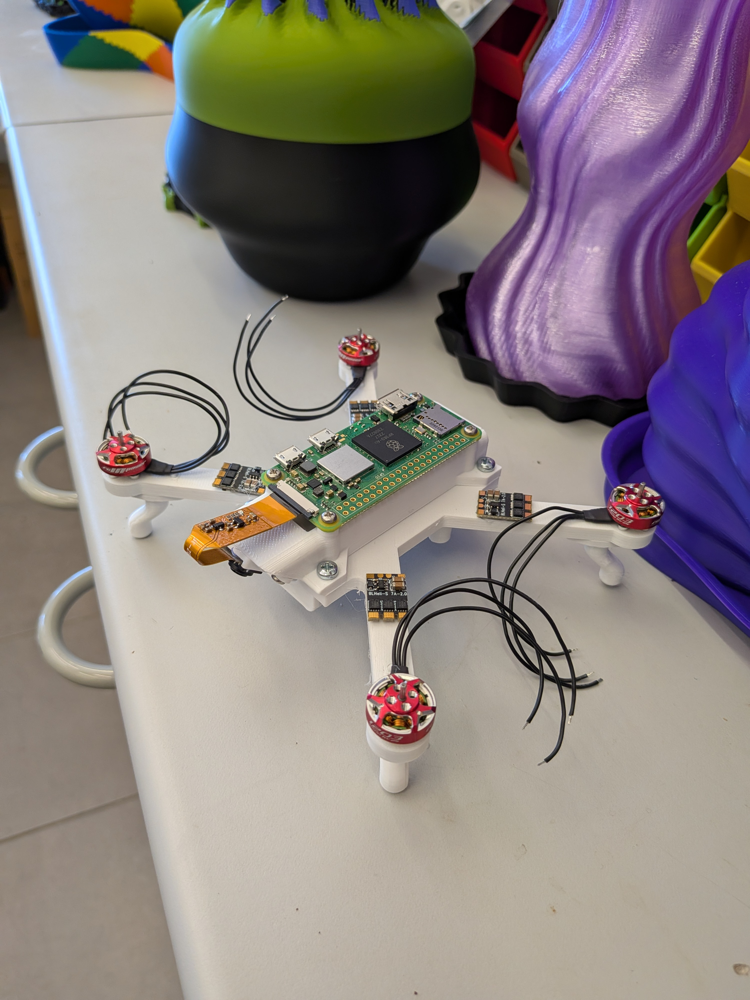

# Drone Design Lab

Drone Design Lab is an educational web project for exploring small-drone component choices and connecting those choices to hands-on lab measurements.

The published site is available at:

<https://tals-education.github.io/DroneDesign/>

The project repository is:

<https://github.com/TALs-Education/DroneDesign>

## Project Idea

Students use the designer to experiment with optional drone configurations before moving into lab work. The tool helps compare batteries, motors, propellers, ESCs, flight-controller hardware, optional add-ons, payload, weight, thrust-to-weight ratio, hover current, and estimated hover time.

In the lab, students measure thrust versus current for different motor and propeller combinations. These measurements connect the design choices in the web tool to real propulsion behavior.

The next step is control: students learn how to stabilize a fixed drone setup. The drone is attached to a load cell for lift measurement and constrained in all axes except one rotational axis. This allows students to practice stabilization and maneuvering in a controlled lab environment before progressing to less constrained flight experiments.

## Selected Design Ver 1

### BOM List

[BOM List](https://docs.google.com/spreadsheets/d/e/2PACX-1vT2DtydTzekY1mokOnh3ZIie18SPq6R37-j9ZMFiFX3chI8BBx9N6xgQAwgINsrMxRPPAHhBhgmAgD4/pubhtml)

The landing page includes a thumbnail of the drone. Selecting the thumbnail opens the full-size image.

## Educational Flow

1. Explore alternative drone designs in the web designer.
2. Select batteries, motors, propellers, ESCs, and optional add-ons.
3. Export a bill of materials for the selected configuration.
4. Measure thrust versus current for motor and propeller combinations.
5. Compare measured propulsion data with design assumptions.
6. Stabilize a fixed drone on the lab rig.
7. Practice controlled maneuvering around the single free rotational axis.

## Running Locally

This is a static site. Open `index.html` in a browser, then follow the link to `DroneDesigner.html`.

## License

This project is licensed under the GNU General Public License. See [LICENSE](LICENSE) for the full license text.
