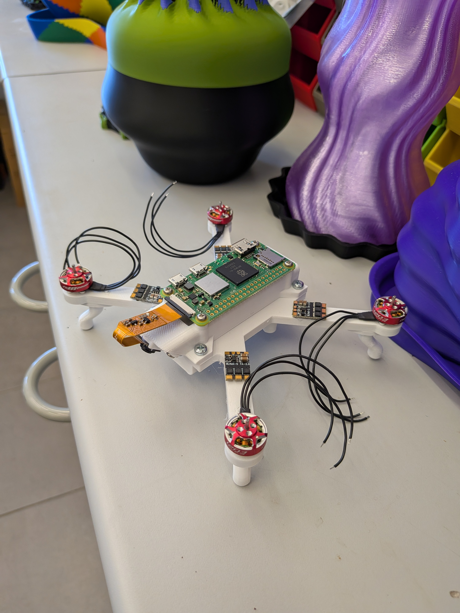

# Drone Design Lab

Drone Design Lab is an educational web project for exploring small-drone component choices and connecting those choices to hands-on lab measurements.

The published site is available at:

<https://tals-education.github.io/DroneDesign/>

The project repository is:

<https://github.com/TALs-Education/DroneDesign>

## Project Idea

Students use the designer to experiment with optional drone configurations before moving into lab work. The tool helps compare batteries, motors, propellers, ESCs, flight-controller hardware, optional add-ons, payload, weight, thrust-to-weight ratio, hover current, and estimated hover time.

In the lab, students measure thrust versus current for different motor and propeller combinations. These measurements connect the design choices in the web tool to real propulsion behavior.

The next step is control: students learn how to stabilize a fixed drone setup. The drone is attached to a load cell for lift measurement and constrained in all axes except one rotational axis. This allows students to practice stabilization and maneuvering in a controlled lab environment before progressing to less constrained flight experiments.

## Selected Design Ver 1



### BOM List

[BOM List](https://docs.google.com/spreadsheets/d/e/2PACX-1vT2DtydTzekY1mokOnh3ZIie18SPq6R37-j9ZMFiFX3chI8BBx9N6xgQAwgINsrMxRPPAHhBhgmAgD4/pubhtml)

### 3D Files

Printable Ver 1 STL files:

- [MainBody.stl](3dFiles/1S_Drone_Ver1/MainBody.stl)
- [TopCover.stl](3dFiles/1S_Drone_Ver1/TopCover.stl)
- [LandingFeet.stl](3dFiles/1S_Drone_Ver1/LandingFeet.stl)
- [Antenna.stl](3dFiles/1S_Drone_Ver1/Antenna.stl)
- [MiniCameraHolder.stl](3dFiles/1S_Drone_Ver1/MiniCameraHolder.stl)
- [StandOff.stl](3dFiles/1S_Drone_Ver1/StandOff.stl)

Fusion 360 model:

[Fusion 360 Model](https://a360.co/3Q0122c)

## Educational Flow

1. Explore alternative drone designs in the web designer.
2. Select batteries, motors, propellers, ESCs, and optional add-ons.
3. Export a bill of materials for the selected configuration.
4. Measure thrust versus current for motor and propeller combinations.
5. Compare measured propulsion data with design assumptions.
6. Stabilize a fixed drone on the lab rig.
7. Practice controlled maneuvering in a protected environment.

## Designer Model

The designer estimates performance from the manufacturer bench data in [DataSheets/](DataSheets/). The in-app **Model & Equations** section (step 7) lists the formulas. In short:

- **Weight:** battery + 4 × (motor + prop + ESC) + flight controller + add-ons + frame + payload, against the 250 g limit.
- **Hover:** thrust per motor = weight / 4. Hover throttle and current are interpolated on the bench curve (thrust and current vs throttle).
- **Flight time:** `capacity_mAh × 0.8 × 60 / (hover current × 1000)` minutes. The hover current includes the flight controller and any add-on decks, with deck power converted to battery current.
- **Prop matching:** prop load `D⁴ · pitch · √blades` (Abbott power rule), compared with the prop the motor was bench-tested with. If a different prop is fitted, the bench curve is rescaled:
  - Full throttle: a DC motor model `ω = KV·(V − I·R)` balanced against prop torque, calibrated on the bench 100 % point.
  - Current at a given thrust scales with `D_ref / D` (momentum theory).
- **Checks:** 250 g limit; hover throttle (> 60 % warns, > 70 % is an error); motor current rating; ESC voltage, continuous and peak current; ESC/FC signal protocol; Crazyflie Bolt 8 A/channel onboard limit; battery continuous and peak current.
- **Payload sweep:** the Build Setup step shows hover throttle, T/W, current and flight time as payload increases, plus the largest payload with no errors and what limits it.

Motors are only offered at a cell count they were bench-tested at. The AMAXInno 1304 datasheet says 2S, but its power ÷ current is ≈ 11.3 V. Its data is therefore filed as 3S, so it is not offered with the 2S packs.

### Validation tools

Both tools need Node.js 18+ and run the app's own JavaScript from `DroneDesigner.html`:

```sh
node tools/check-datasheets.mjs   # every DB value vs DataSheets/*.txt (exit 1 on mismatch)
node tools/sweep.mjs              # all combinations × payloads: best builds and payload capacity
node tools/sweep.mjs --csv --frame 25 --payloads 0,10,20,30 > sweep.csv
```

## License

This project is licensed under the GNU General Public License. See [LICENSE](LICENSE) for the full license text.
